# AWS VPC with Bastion Host and NAT Gateway

A hands-on project where I built a custom AWS VPC from the ground up — public and private subnets, an internet gateway, a NAT gateway, and a bastion host — and then actually proved the whole thing works by SSHing through it and pulling a live page over the internet from a private instance.

I built this to understand network isolation the way it's actually used in real environments, not just to tick a box. Most "VPC projects" stop at creating resources in the console. I wanted to go one step further and confirm that traffic actually flows the way it's supposed to.

## Architecture

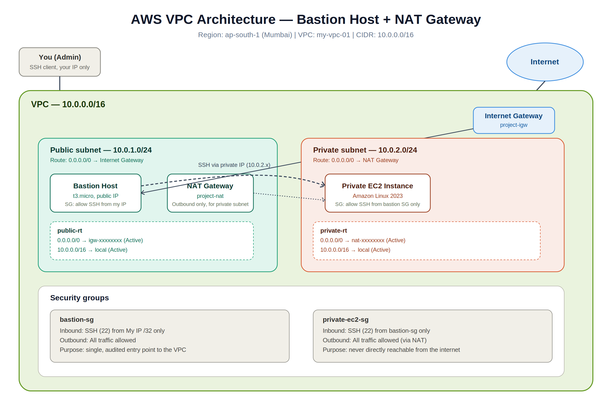

**Region:** ap-south-1 (Mumbai)
**VPC CIDR:** 10.0.0.0/16

| Component | Details |
|---|---|
| Public subnet | 10.0.1.0/24 — routes to Internet Gateway |
| Private subnet | 10.0.2.0/24 — routes to NAT Gateway |
| Internet Gateway | Attached to the VPC, gives the public subnet a path in/out |
| NAT Gateway | Sits in the public subnet, gives the private subnet outbound-only internet access |
| Bastion host | EC2 in the public subnet, the only way in from outside |
| Private EC2 | No public IP, reachable only through the bastion |

The idea is simple: nothing in the private subnet is ever exposed to the internet directly. Anyone wanting to reach the private instance has to go through the bastion first, and the private instance can only reach the internet outbound — never accept inbound connections from it.

## What I actually built

**1. Created the VPC**

Started with a 10.0.0.0/16 VPC and named it `my-vpc-01`.

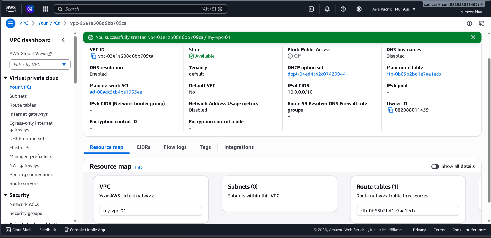

**2. Created the subnets**

Split it into a public subnet (10.0.1.0/24) and private subnet (10.0.2.0/24), both in the same AZ for simplicity.

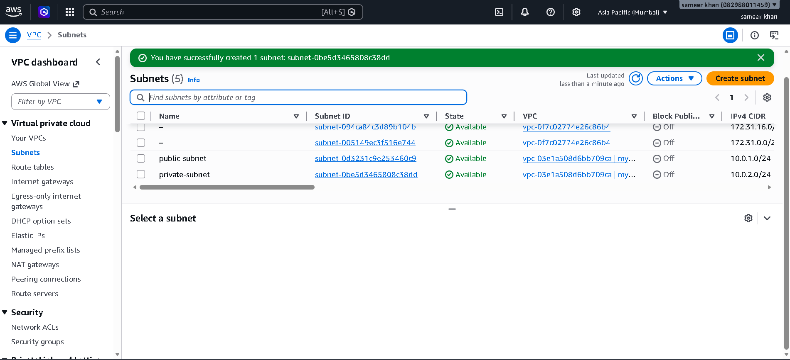

**3. Attached an Internet Gateway**

Created `project-igw` and attached it to the VPC so the public subnet has a route out.

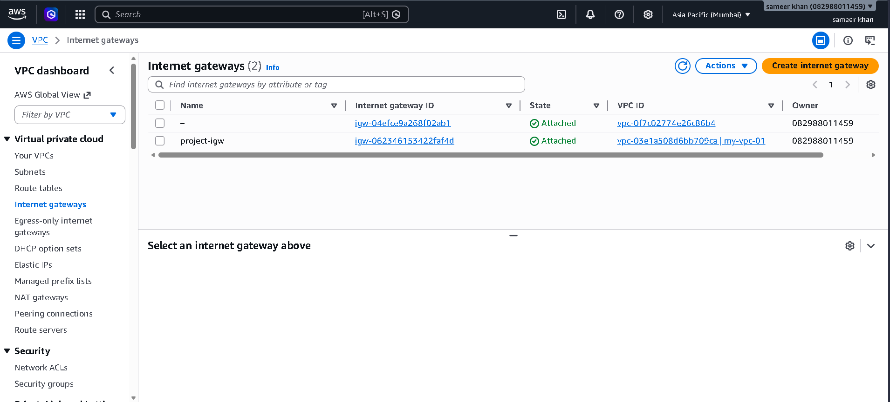

**4. Created a NAT Gateway**

Placed `project-nat` in the public subnet, with an Elastic IP, so the private subnet can reach the internet for things like package updates — without being reachable from it.

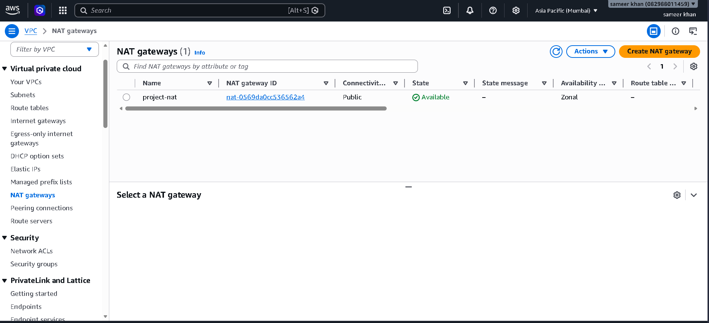

**5. Configured route tables**

Two separate route tables, each doing exactly one job:

- `public-rt`: `0.0.0.0/0 → igw`, plus the local VPC route
- `private-rt`: `0.0.0.0/0 → nat`, plus the local VPC route

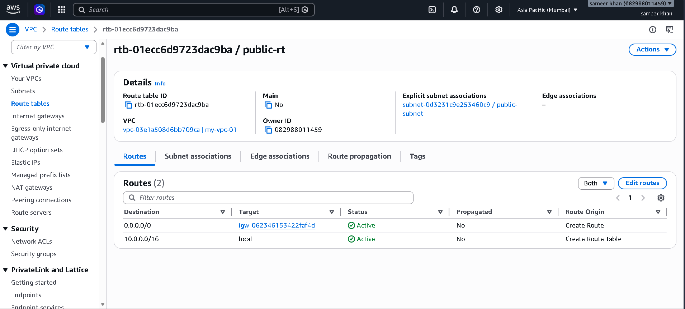
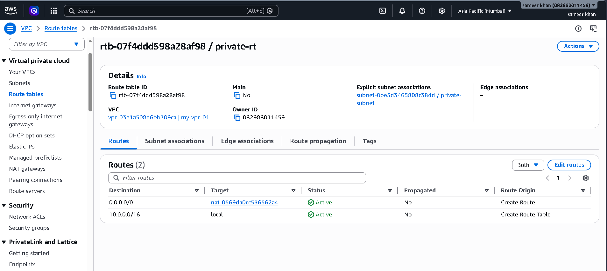

**6. Launched the bastion host**

A `t3.micro` running Amazon Linux 2023 in the public subnet, with a public IP, acting as the single entry point into the VPC.

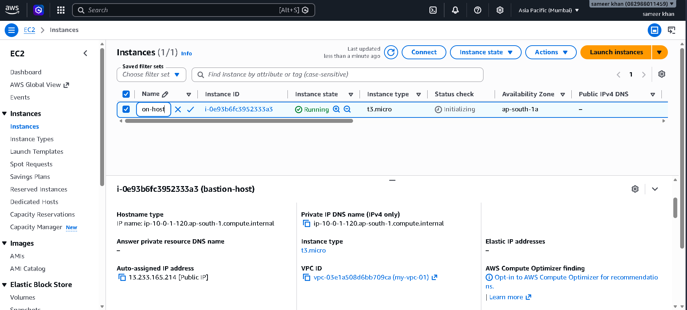

## Security groups

This is the part I spent the most time getting right, because a VPC is only as secure as its security groups.

**bastionhost-sec** — attached to the bastion

| Type | Protocol | Port | Source |
|---|---|---|---|
| Inbound | TCP | 22 | My IP only (`/32`) |
| Outbound | All | All | 0.0.0.0/0 |

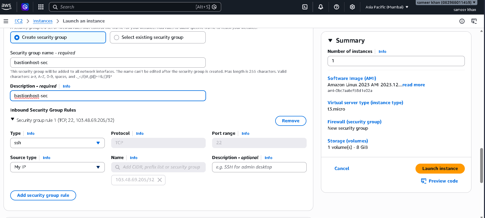

**privatesub-sec** — attached to the private EC2 instance

| Type | Protocol | Port | Source |
|---|---|---|---|
| Inbound | TCP | 22 | `bastionhost-sec` (security group reference) |
| Outbound | All | All | 0.0.0.0/0 (via NAT) |

I initially scoped this to the public subnet's CIDR (`10.0.1.0/24`), which technically works but isn't quite right — it would let *any* instance in that subnet SSH into the private one, not just the bastion. I went back and changed the source to reference the bastion's security group directly instead of an IP range, so access is tied to the actual host, not just where it happens to be sitting in the network.

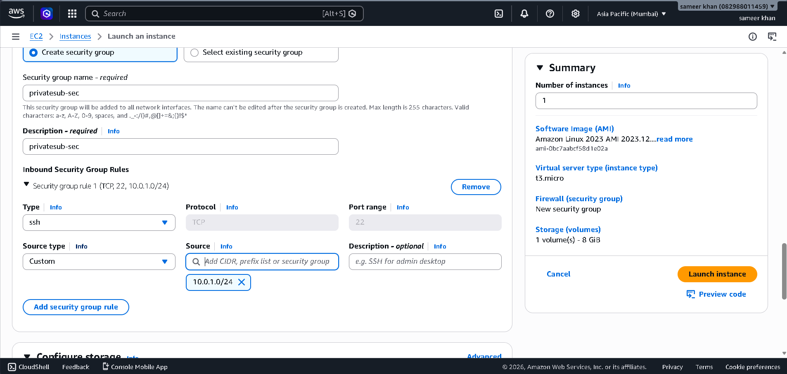
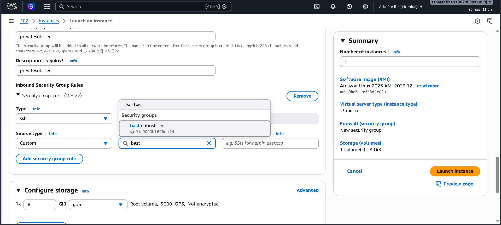

## Proving it actually works

Creating resources in the console is the easy part. The part that actually matters is whether traffic flows the way the architecture says it should — so I tested it end to end.

I SSH'd into the bastion, then from inside the bastion SSH'd again into the private instance using its private IP:

```bash
ssh -i "sameerkey.pem" ec2-user@10.0.2.73
```

First attempt failed — not because of routing or security groups, but because of file permissions on the key itself:

```
Permissions 0777 for 'sameerkey.pem' are too open.
Load key "sameerkey.pem": bad permissions
```

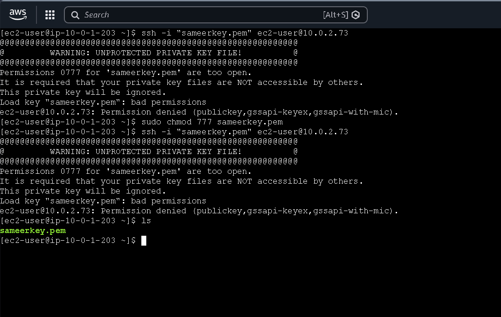

SSH refuses to use a private key that's readable by everyone, which is correct behavior — I'd actually made it worse by running `chmod 777` first. Fixed it properly with:

```bash
chmod 400 sameerkey.pem
```

After that, the connection went through cleanly, and once inside the private instance I confirmed outbound internet access through the NAT gateway:

```bash
sudo yum update -y
curl google.com
```

Both worked — the update ran with no errors and `curl` got a real response back from Google, confirming the NAT gateway was correctly routing outbound traffic for an instance that has no public IP of its own.

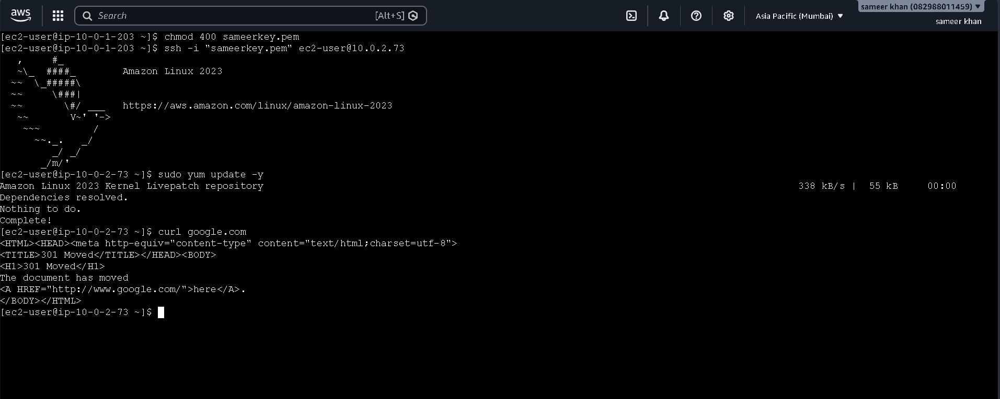

## What I'd do next

- Convert this into Terraform so the whole thing is reproducible from code instead of console clicks
- Add CloudWatch alarms on the NAT gateway and bastion
- Try replacing the bastion with AWS Systems Manager Session Manager to remove the need for an open SSH port entirely

## Why I built this

I'm working toward cloud and DevOps engineering roles, and wanted a project that proves I understand *why* a network is built a certain way, not just that I can follow a tutorial. The permission error and the security group fix weren't planned — they happened naturally, and I left them in because debugging real problems is a bigger part of this work than getting it right on the first try.
